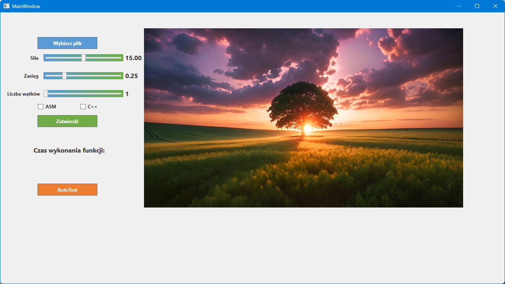
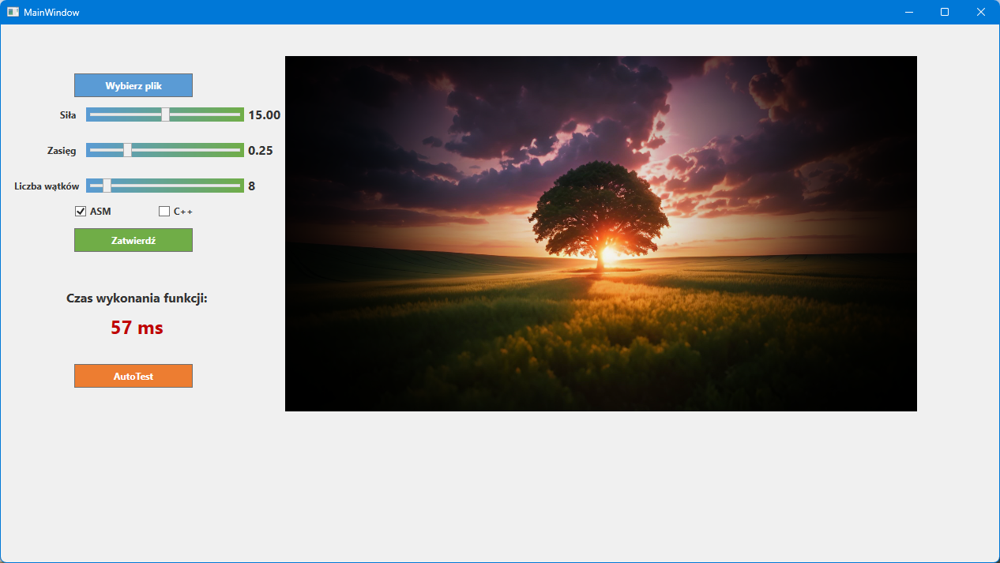

# Winieta BMP – Aplikacja do nakładania efektu winiety

Program służy do nakładania efektu winiety na obrazy w formacie `.bmp`. Umożliwia użytkownikowi dostosowanie parametrów efektu oraz wybór implementacji (ASM lub C++) i liczby wątków do przetwarzania obrazu.

---

## 🖥️ Funkcjonalności

- Nakładanie efektu winiety z możliwością regulacji:
  - **Siły winiety** (twardość)
  - **Zasięgu winiety** (obszar działania)
- Wybór liczby wątków wykorzystywanych przy przetwarzaniu
- Wybór implementacji:
  - **ASM** – wersja wykonująca winietę w asemblerze
  - **C++** – wersja wykonująca winietę w c++
- Obsługa obrazów w formacie `.bmp`
- Prosty interfejs graficzny

---

## 🚀 Jak używać

1. **Uruchom aplikację**
2. **Załaduj obraz** w formacie `.bmp`
3. Ustaw parametry winiety:
   - **Siła** – im mniejsza wartość, tym efekt jest bardziej miękki
   - **Zasięg** – im mniejsza wartość, tym efekt obejmuje większy obszar
4. **Wybierz liczbę wątków**, które mają zostać użyte do przetwarzania
5. Zaznacz, czy chcesz użyć wersji:
   - ASM
   - C++
6. Kliknij przycisk **"Zatwierdź"**, aby zastosować efekt winiety
7. (Opcjonalnie) Użyj funkcji **AutoTest**, by automatycznie przetestować wydajność tworzenia winiety dla poszczególnej ilości wątków (w folderze z aplikacją musi znajdować się obraz o nazwie test.bmp)

---

## 🛠️ Implementacja efektu winiety

Efekt winiety realizowany jest poprzez modyfikację jasności pikseli w zależności od ich odległości od środka obrazu. Proces przebiega następująco:

1. Obliczenie odległości piksela od środka maski
2. Normalizacja odległości
3. Dostosowanie zasięgu i siły na podstawie wartości podanych przez użytkownika
4. Obliczenie wartości maski:
   - przy użyciu szeregu Taylora (dla ASM)
   - przy użyciu funkcji `exp(x)` (dla C++)
6. Zastosowanie maski jako mnożnika wartości piksela

## 🖼️ Efekt winiety – obraz przed i po

